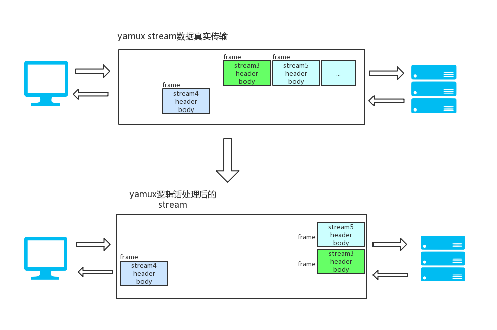
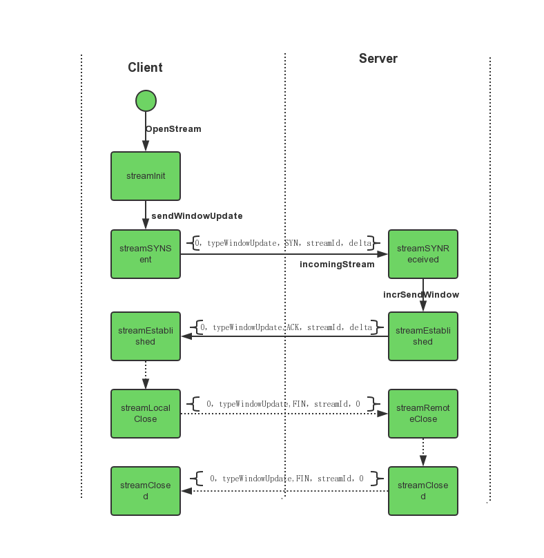

# yamux源码分析

yamux是golang连接多路复用（connection multiplexing）的一个库，想法来源于google的SPDY（也就是后来的http2）。yamux能用很小的代价在一个真实连接（net connection）上实现上千个Client-Server逻辑流。

## 基本概念

- session（会话）
  session用于包裹（wrap）可靠的有序连接（net connection）并将其多路复用为多个流（stream）。

- stream（流）
  在session中，stream代表一个client-server逻辑流。stream有唯一且自增（+2）的id，客服端向server端的stream id为奇数，服务端向客户端发送的stream为偶数，同事0值代表session。stream是逻辑概念，传输的数据是以帧的形态传输的。
  
- frame（帧）  
  帧是在session中真正传输的数据，帧有两部分header和body
  - header包含12个字节的数据，（也就算每次消息发送会参数额外12字节）。
    - Version (8 bits) 协议版本，目前总是为0
    - Type (8 bits)  帧消息类型，
        - 0x0（Data）数据传输
        - 0x1（Window Update） 用更新stream收消息recvWindow的大小。（注意这个时候length字段则为窗口的增量值）
        - 0x2（Ping）心跳，keep alives和RTT度量作用
        - 0x3（Go Away） 用于关闭会话
    - Flags (16 bits)  
        - 0x1 SYN : 新stream需要被创建
        - 0x2 ACK : 确认新stream开始
        - 0x4 FIN : 执行stream的半关闭
        - 0x8 RST : 立即重置stream
    - StreamID (32 bits) 流ID用于区分逻辑流
    - Length (32 bits)  body的长度或者type为Window Update时的delta值
   - body 是真实需要传输的数据，可能没有。

## 实现原理 

### yamux multiplexing 如何实现的

 从上图我们可以看出multiplexing的原理：传输过程中使用frame传输，每个frame都带有stream ID，在传输过程中stream相同stream的数据有先后顺序但可能不是连续的，接收端通过逻辑映射关系整合成有序的stream。

### stream的状态变迁
类似tcp连接，每一个stream都是有链接状态的。一个新的stream在创建的时候client会向server发送SYN信息，server端接收到SYN信息后会回传ACK信息。close的时候会给对方发送FIN，对方接收到同样会回一个FIN。这个过程会伴随整个stream的状态变迁。
 
上图还有一种 `streamReset` 状态没有呈现，server端Accept等待队列满的时候会发`flagRST`送给client的信息，client收到这个消息后会把流状态设置成`streamReset`，这个时候流会停止。

从上面的分析来看，

## 源码分析
我们从run一个它的demo
```golang

```

### 创建session
创建session只能通过 `Server(conn io.ReadWriteCloser, config *Config) `和 `func Client(conn io.ReadWriteCloser, config *Config) ` 这两个方法创建，注意


# 参考文档

- [yamux](https://github.com/hashicorp/yamux/blob/master/spec.md)
- [go-libp2p 之 NewStream 深层阅读笔记](https://www.jianshu.com/p/14781d900501)
