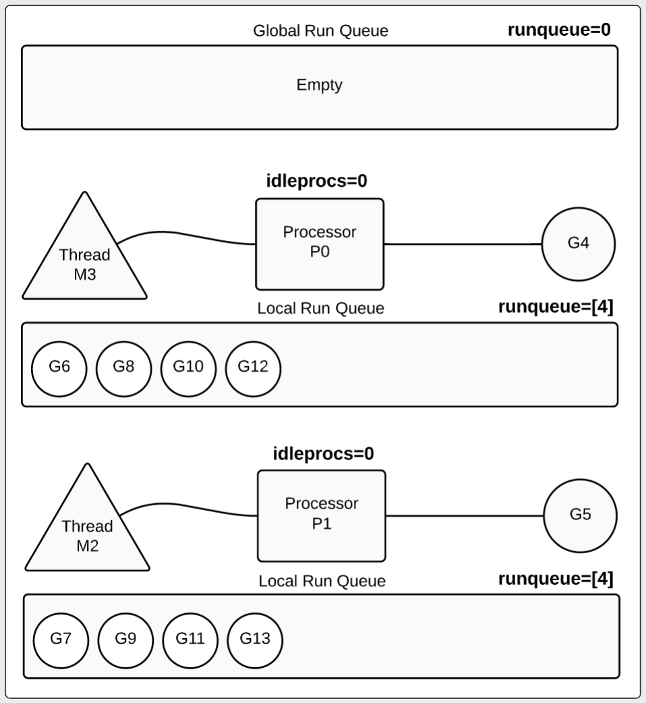
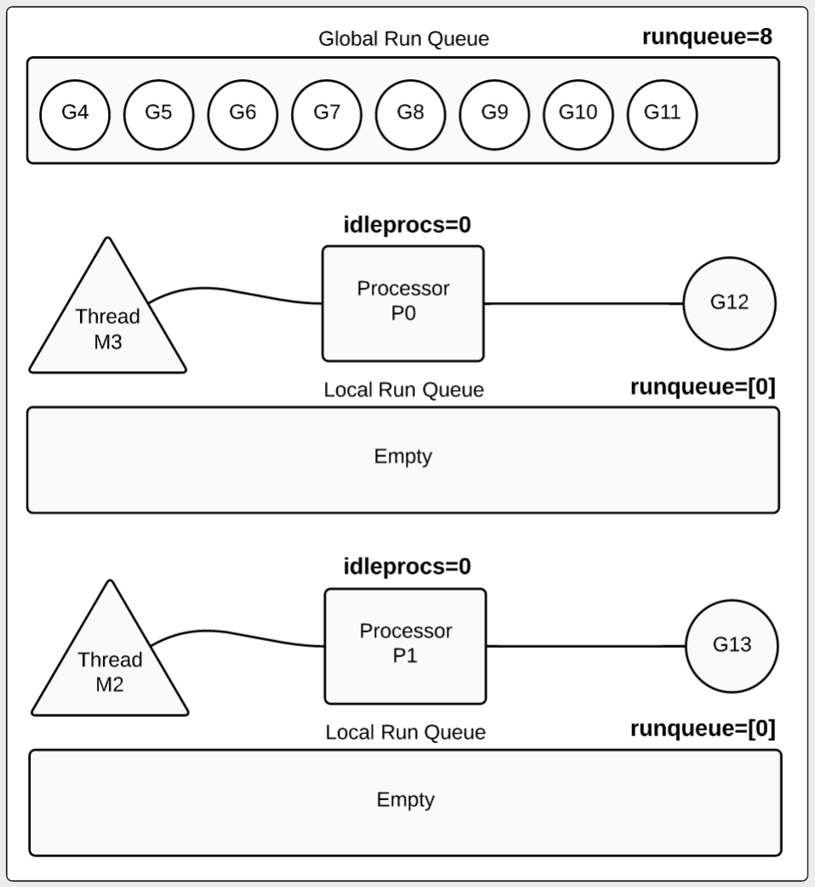

# GODEBUG追踪调度器


go可执行程序本身能产生一些profiling和debug信息。设置环境变量GODEBUG能让go的可执行程序运行时打印调试信息（标准错误输出），你可以通过改变环境变量`GODEBUG`的值收集go调度器和垃圾回收器的概要或者详细信息。只需要设置环境变量`GODEBUG`就可以，不需要你在go build的时候设置任何编译选项开关。

本小节我们翻译下[scheduler-tracing-in-go](https://www.ardanlabs.com/blog/2015/02/scheduler-tracing-in-go.html)博文来介绍下利用环境变量`GODEBUG`追踪go的调度器。

我们设计一个程序来验证下。

```go
package main
import (
	"sync"
	"time"
)
func main() {
	var wg sync.WaitGroup
	wg.Add(10)
	for i := 0; i < 10; i++ {
		go work(&wg)
	}
	wg.Wait()
	// Wait to see the global run queue deplete.
	time.Sleep(3 * time.Second)
}
func work(wg *sync.WaitGroup) {
	time.Sleep(time.Second)
	var counter int
	for i := 0; i < 1e10; i++ {
		counter++
	}
	wg.Done()
}
```

我们先编译go程序
```
$ go build -o test
```

## 查看摘要信息
我们设置下`GOMAXPROCS`和`GODEBUG` 运行`test`程序，我们的程序本身没有任何输出，你会发现终端打印如下内容

```bash
$ GOMAXPROCS=1 GODEBUG=schedtrace=1000 ./test
SCHED 0ms: gomaxprocs=1 idleprocs=0 threads=3 spinningthreads=0 idlethreads=0 runqueue=0 [2]
SCHED 1000ms: gomaxprocs=1 idleprocs=0 threads=3 spinningthreads=0 idlethreads=1 runqueue=0 [9]
SCHED 2007ms: gomaxprocs=1 idleprocs=0 threads=3 spinningthreads=0 idlethreads=1 runqueue=0 [9]
SCHED 3013ms: gomaxprocs=1 idleprocs=0 threads=3 spinningthreads=0 idlethreads=1 runqueue=0 [9]
```

我们`GOMAXPROCS=1`代表设置go `processors`为1， `GODEBUG=schedtrace=1000`跟踪调度器信息，每秒钟打印一次。

我们来解释下日志字段的含义

```
1000ms        : 代表程序运行开始到现在运行的毫秒数，我们每秒钟打印一次，所以这个数组大概都是1000的整数倍
gomaxprocs=1  : 我们设置的gomaxprocs=1
idleprocs=0   : processors空闲数，0空闲(1个正在忙).
threads=3     : go runtime 管理的系统线程数，1个为processors专用，另外2个为go runtime使用
idlethreads=1 : 空闲线程数量 1个空闲(2个忙).
runqueue=0    : 全局goroutine 等待运行队列数，0代表全局队列为空，全部到local的等待运行queue.
[9]           : 本地goroutines 等待运行队列数（这边processors为1，所以只有个数值，多个processors时就有多个数值）.9 个goroutines 在本地队列等待运行.
```

我们在程序运行时我们收集了很多有用的概要信息，我们看下在运行后1秒的那个tracing信息，我们可以到1个goroutine正在运行，其他9个在本地运行队列等待。


上图中`processors`用P表示，threads（系统线程）用M表示，goroutine用G表示，图中展示全局等待运行队列为空，`processors`正在运行一个goroutine（G4），其他9个在本地等待运行队列中。

接下来我们看下多个`processors`下运行的情况。


```bash
$ GOMAXPROCS=2 GODEBUG=schedtrace=1000 ./test
SCHED 0ms: gomaxprocs=2 idleprocs=1 threads=2 spinningthreads=0 idlethreads=0 runqueue=0 [0 0]
SCHED 1002ms: gomaxprocs=2 idleprocs=0 threads=4 spinningthreads=1 idlethreads=1 runqueue=0 [0 4]
SCHED 2006ms: gomaxprocs=2 idleprocs=0 threads=4 spinningthreads=0 idlethreads=1 runqueue=0 [4 4]
…
SCHED 6024ms: gomaxprocs=2 idleprocs=0 threads=4 spinningthreads=0 idlethreads=1 runqueue=2 [3 3]
…
SCHED 10049ms: gomaxprocs=2 idleprocs=0 threads=4 spinningthreads=0 idlethreads=1 runqueue=4 [2 2]
…
SCHED 13067ms: gomaxprocs=2 idleprocs=0 threads=4 spinningthreads=0 idlethreads=1 runqueue=6 [1 1]
…
SCHED 17084ms: gomaxprocs=2 idleprocs=0 threads=4 spinningthreads=0 idlethreads=1 runqueue=8 [0 0]
…
SCHED 21100ms: gomaxprocs=2 idleprocs=2 threads=4 spinningthreads=0 idlethreads=2 runqueue=0 [0 0]
```

我们看下第2秒的情况

```
SCHED 2002ms: gomaxprocs=2 idleprocs=0 threads=4 spinningthreads=0 idlethreads=1 runqueue=0 [4 4]
2002ms        : 程序运行了2秒.
gomaxprocs=2  : 配置了2个`processors`.
threads=4     : 4 个系统线程 2 个给processors，剩下2个go runtime使用.
idlethreads=1 : 1个空闲系统线程 (3个系统线程忙).
idleprocs=0   : 0个processors空闲(2个都在忙).
runqueue=0    : 所以的 goroutine都分配到本地运行等待队列中，全局等待队列为空.
[4 4]         : 每一个本地等待运行队列都分配了4个goroutine。
```


上图展示了第二秒的时候，goroutine是如何被`processors`运行，同样能看到每个goroutine在本地等待运行队列的情况。8个goroutine在本地等待运行队列等待，每个本地等待运行队列包含4个goroutine。

在看下第6秒的情况

```
SCHED 6024ms: gomaxprocs=2 idleprocs=0 threads=4 spinningthreads=0 idlethreads=1 runqueue=2 [3 3]
idleprocs=0 : 0 个`processors`空闲 (2 processors busy).
runqueue=2  : 2 个goroutines 到全局等待运行队列中（等待被回收）
[3 3]       : 每个本地等待运行队列中有3个goroutines早等待 .
```


上图展示了第6秒是的一些变化，有2个`goroutine`执行完成后回到全局等待运行队列。有两个goruntine在运行正在运行，每个P各运行一个。每个本地等待运行队列中各有有3个goroutine。


注意:
```
大多数情况下，goroutine在即将被销毁前不会被移动到全局等待运行队列。本文中的例子比较特殊。goroutine中是一个for循环，没有调用其他函数，并且运行总时长超过10毫秒。10毫秒是go调度器的一个调度指标，超过10毫秒的执行时长的goroutine，go调度器就会尝试抢占(preempt，其实就是要暂时挂起goroutine，让其他goroutine执行的意思)这个goroutine。本例子中的goroutine由于没有调用其他函数（go编译器一般会在函数中加入汇编指令用来挂起goroutine来配合调度器调度），所以不能被抢占。当程序运行到wg.Done的时候，这个时候被抢占了，所以这个goroutine被移动到全局等待队列中，随后会被销毁。
```

时间来到第17秒
```
SCHED 17084ms: gomaxprocs=2 idleprocs=0 threads=4 spinningthreads=0 idlethreads=1 runqueue=8 [0 0]
idleprocs=0 : 0个processors空闲(2个processors忙).
runqueue=8  : 8个goroutines都在全局等待队列中.
[0 0]       : 本地等待运行队列都为空
```


上图中我们看到本地运行队列都为空，还有2个goroutine正在运行，其余8个goroutine都在全局等待运行队列中。

时间来到第21秒

```
SCHED 21100ms: gomaxprocs=2 idleprocs=2 threads=4 spinningthreads=0 idlethreads=2 runqueue=0 [0 0]
idleprocs=2 : 2个processors空闲(0个processors忙).
runqueue=0  : 全局运行队列为空（10个goroutine全部被销毁）
[0 0]       : 本地等待运行队列都为空
```


如上图所示，所有的goroutine都已经被销毁。


## 查看详细信息

调度器的摘要信息通常很有用，但是某些时候你想更深入了解细节，这个时候我们可以加上`scheddetail`选项，然后程序运行是会打印出每个`processor`，线程，goroutine的详细调度细节。
我们再用下面的命令运行下程序

```
$ GOMAXPROCS=2 GODEBUG=schedtrace=1000,scheddetail=1 ./test
```
这边我们看下第4秒的信息
```
SCHED 4028ms: gomaxprocs=2 idleprocs=0 threads=4 spinningthreads=0 idlethreads=1 runqueue=2 gcwaiting=0 nmidlelocked=0 stopwait=0 sysmonwait=0
P0: status=1 schedtick=10 syscalltick=0 m=3 runqsize=3 gfreecnt=0
P1: status=1 schedtick=10 syscalltick=1 m=2 runqsize=3 gfreecnt=0
M3: p=0 curg=4 mallocing=0 throwing=0 gcing=0 locks=0 dying=0 helpgc=0 spinning=0 blocked=0 lockedg=-1
M2: p=1 curg=10 mallocing=0 throwing=0 gcing=0 locks=0 dying=0 helpgc=0 spinning=0 blocked=0 lockedg=-1
M1: p=-1 curg=-1 mallocing=0 throwing=0 gcing=0 locks=1 dying=0 helpgc=0 spinning=0 blocked=0 lockedg=-1
M0: p=-1 curg=-1 mallocing=0 throwing=0 gcing=0 locks=0 dying=0 helpgc=0 spinning=0 blocked=0 lockedg=-1
G1: status=4(semacquire) m=-1 lockedm=-1
G2: status=4(force gc (idle)) m=-1 lockedm=-1
G3: status=4(GC sweep wait) m=-1 lockedm=-1
G4: status=2(sleep) m=3 lockedm=-1
G5: status=1(sleep) m=-1 lockedm=-1
G6: status=1(stack growth) m=-1 lockedm=-1
G7: status=1(sleep) m=-1 lockedm=-1
G8: status=1(sleep) m=-1 lockedm=-1
G9: status=1(stack growth) m=-1 lockedm=-1
G10: status=2(sleep) m=2 lockedm=-1
G11: status=1(sleep) m=-1 lockedm=-1
G12: status=1(sleep) m=-1 lockedm=-1
G13: status=1(sleep) m=-1 lockedm=-1
G17: status=4(timer goroutine (idle)) m=-1 lockedm=-1
```

从上面的信息来看，摘要信息没什么变化，但是详细信息多了每个`processor`，线程，和goroutine的信息行。我们先看下`processor`的信息
```
P0: status=1 schedtick=10 syscalltick=0 m=3 runqsize=3 gfreecnt=0
P1: status=1 schedtick=10 syscalltick=1 m=2 runqsize=3 gfreecnt=0
```
我们设置了`GOMAXPROCS=2`所以`processor`的信息只有2行。

再看下线程的信息

```
M3: p=0 curg=4 mallocing=0 throwing=0 gcing=0 locks=0 dying=0 helpgc=0 spinning=0 blocked=0 lockedg=-1
M2: p=1 curg=10 mallocing=0 throwing=0 gcing=0 locks=0 dying=0 helpgc=0 spinning=0 blocked=0 lockedg=-1
M1: p=-1 curg=-1 mallocing=0 throwing=0 gcing=0 locks=1 dying=0 helpgc=0 spinning=0 blocked=0 lockedg=-1
M0: p=-1 curg=-1 mallocing=0 throwing=0 gcing=0 locks=0 dying=0 helpgc=0 spinning=0 blocked=0 lockedg=-1
```
M代表一个系统线程，我们在摘要信息中thread=4，所以会有4条线程信息。详细信息还显示了线程是属于那个processor。

```
P0: status=1 schedtick=10 syscalltick=0 `m=3` runqsize=3 gfreecnt=0   //m=3 
M3: `p=0` curg=4 mallocing=0 throwing=0 gcing=0 locks=0 dying=0 helpgc=0 spinning=0 blocked=0 lockedg=-1 //p=0 
```
我们看到M3绑定到P0，这个绑定关系在两者的详细信息中都有体现。

G代表goroutine，第4秒我们看到目前有14个goroutine, 但是从程序启动开始到打印日志的时候已经创建了17个线程。怎么知道创建了17个线程呢？这是从最后的goroutine的标志G17得来。

```
G17: status=4(timer goroutine (idle)) m=-1 lockedm=-1
```

如果该程序继续创建goroutine，我们将看到该数字呈线性增加。如果此程序正在处理Web请求，则可以使用该数字来大致判断已经处理的请求数（仅当程序在处理请求期间不会创建其他goroutine时）。

接下来我们看下main运行的goroutine
```
G1: status=4(semacquire) m=-1 lockedm=-1
```
我们可以看到main函数所在goroutine状态是4（status=4(semacquire)），并且被`waitgroup.Wait`阻塞住。

为了更好地理解goroutine追踪信息，了解每个goroutine状态编号代表什么是很有帮助的，下面是状态代码列表：
```
status: http://golang.org/src/runtime/
Gidle,            // 0
Grunnable,        // 1 runnable and on a run queue
Grunning,         // 2 running
Gsyscall,         // 3 performing a syscall
Gwaiting,         // 4 waiting for the runtime
Gmoribund_unused, // 5 currently unused, but hardcoded in gdb scripts
Gdead,            // 6 goroutine is dead
Genqueue,         // 7 only the Gscanenqueue is used
Gcopystack,       // 8 in this state when newstack is moving the stack
```

对照如上的表格，我们整理下我们创建的10个goroutine，现在我们可以更好的了解它们。

```
// Goroutines running in a processor. (idleprocs=0)
G4: status=2(sleep) m=3 lockedm=-1   – Thread M3 / Processor P0
G10: status=2(sleep) m=2 lockedm=-1  – Thread M2 / Processor P1

// Goroutines waiting to be run on a particular processor. (runqsize=3)
G5: status=1(sleep) m=-1 lockedm=-1
G7: status=1(sleep) m=-1 lockedm=-1
G8: status=1(sleep) m=-1 lockedm=-1

// Goroutines waiting to be run on a particular processor. (runqsize=3)
G11: status=1(sleep) m=-1 lockedm=-1
G12: status=1(sleep) m=-1 lockedm=-1
G13: status=1(sleep) m=-1 lockedm=-1

// Goroutines waiting on the global run queue. (runqueue=2)
G6: status=1(stack growth) m=-1 lockedm=-1
G9: status=1(stack growth) m=-1 lockedm=-1
```

对go调度器调度有基本的了解，能帮助我们更好的了解go程序中`processor`（P），线程（M），goroutine（G）的调度过程以及他们的运行状态。


## 总结
本小节我们通过翻译[scheduler-tracing-in-go](https://www.ardanlabs.com/blog/2015/02/scheduler-tracing-in-go.html)了解通过环境变量GODEBUG追踪go调度器。
GODEBUG环境变量是go程序运行时追踪go调度器利器。它可以告诉你很多有关go程序运行方式的信息。go调度器的追踪对你优化go程序，甚至判断是否有goroutine泄露都很有帮助。

## 参考资料

- [scheduler-tracing-in-go](https://www.ardanlabs.com/blog/2015/02/scheduler-tracing-in-go.html)
