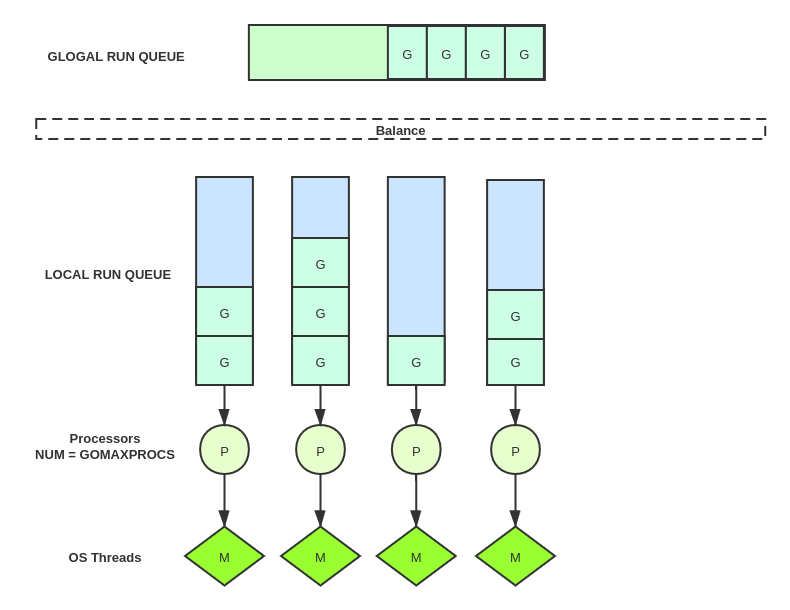

# go的调度器


## GMP调度模型

- G表示Goroutine；
- M表示一个操作系统的线程；
- P表示一个CPU处理器，通常P的数量等于CPU核数（GOMAXPROCS）。



如上图所示

- 全局队列的作用是负载均衡（Balance）。
- M需要和P绑定后不停的执行G的任务。
- P本地有个任务队列，可以无锁状态下执行高效操作。当本地队列为空时会尝试去全局队列去获取G，如果全局队列也为空，这个时候从其他有G的P哪里偷取一半G过来，放到自己的P本地队列。
- M和P并不一定是一一对应的，通常P数量是等于GOMAXPROCS，M的数量则由调度器的监控线程决定的。

我们再看下《Go 1.5 源码剖析 》中的示意图
```
                           +-------------------- sysmon ---------------//-------+
                           |                                                    |
                           |                                                    |
               +---+      +---+-------+                   +--------+          +---+---+
go func() ---> | G | ---> | P | local | <=== balance ===> | global | <--//--- | P | M |
               +---+      +---+-------+                   +--------+          +---+---+
                            |                                 |                 |
                            |      +---+                      |                 | 
                            +----> | M | <--- findrunnable ---+--- steal <--//--+
                                   +---+
                                     |                          1. 语句go func() 创建G
                                     |                          2. 放入P本地队列或者平衡到全局队列
            +--- execute <----- schedule                        3. 唤醒或者新建M执行任务
            |                        |                          4. 进入调度循环 schedul
            |                        |                          5. 竭力获取待执行 G 任务并执行
            +--> G.fn --> goexit ----+                          6. 清理现场，重新进入调度循环
```

```
M 通过修改寄存器，将执⾏栈指向 G ⾃带栈内存，并在此空间内分配堆栈帧，执⾏任务函数。
当需要中途切换时，只要将相关寄存器值保存回 G 空间即可维持状态，任何 M 都可据此恢复执⾏。
线程仅负责执⾏，不再持有状态，这是并发任务跨线程调度，实现多路复⽤的根本所在。
```

## 调试调度器

调试go调度器,我们有专门的小节来介绍[GODEBUG追踪调度器](../go调试/GODEBUG追踪调度器.md)


## 参考资料

- [雨痕的golang源码剖析](https://github.com/qyuhen/book)
- [Go调度器系列（3）图解调度原理](https://segmentfault.com/a/1190000018775901)