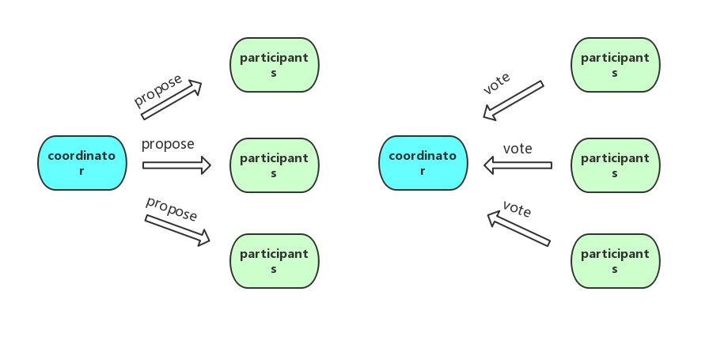
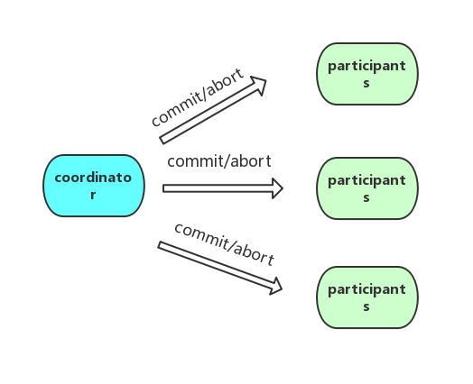

# 分布式一致性算法——2PC（二阶段提交）

## 二阶段提交算法（Two-phase Commit，即2PC）

二阶段提交参与者有两种角色：协调者(coordinator)和参与者(participants)

二阶段提交顾名思义有两个阶段：

- 第一个阶段称为准备阶段，调者(coordinator)向所有参与者（participants）发送提议(propose)并分别收咨询他们的意见，并且收集它们的反馈(vote)。

    

- 第二个阶段称为提交阶段，协调者(coordinator)根据反馈情况决定是提交（commit）或者中止(abort)事务。

    

阶段2收集到的已经只要有一个是`abort`的话，整个事务就中止，当所有的参与者都给的反馈是`commit`的时候事务才提交。

## 二阶段提交的问题

如我们上一个小节介绍的二阶段提交属于CA（一致性+可用性）系统,当有节点宕机的时候，二阶段提交加故障处理就会变得复杂。

二阶段提交的主要问题：

- 同步阻塞问题,二阶段提交的vote过程是同步阻塞的。
- 协调者单点问题
- 在协调者和参与者都宕机的情况下，可能出现严重的阻塞问题。在第二阶段协调者和一个参与者同时宕机，而且这个参与者在宕机前已经做了操作（commit/abort），这个时候协调者恢复，由于不知道宕机参与者的状态，协调者没办法判断是提交还是中止，这个时候只能等宕机的参与者恢复。
- 脑裂问题，如果在第二点只有部分参与者收到执行命令，那么将导致数据不一致。

## 三阶段提交算法（three-phase Commit，即3PC）

三阶段提交算法（Three-Phase Commit， 3PC）最关键要解决的就是 coordinator和参与者同时挂掉导致数据不一致的问题，所以3PC在 2PC 中又添加一个阶段，这样三阶段提交就有：`CanCommit`、`PreCommit` 和`DoCommit`三个阶段。

3PC虽然能解决部分2PC的问题，但是同样过多的交互会导致其他的问题，3PC在实际项目中很少使用。感兴趣的同学可以去了解下，这边不再赘述。

