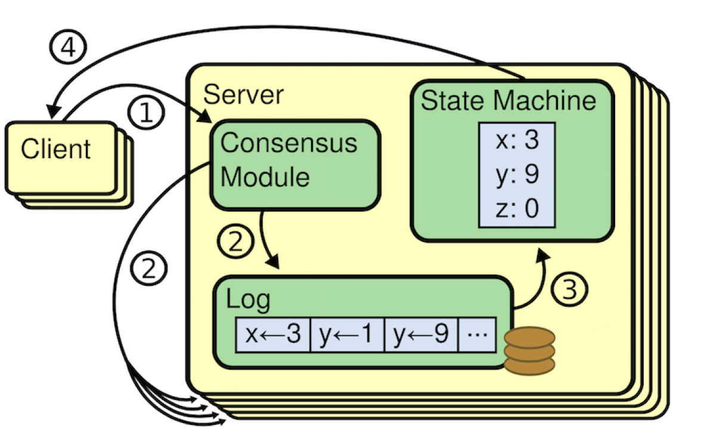
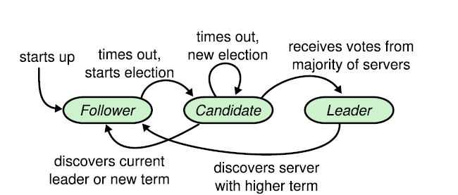
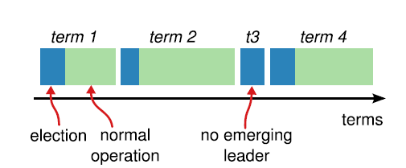
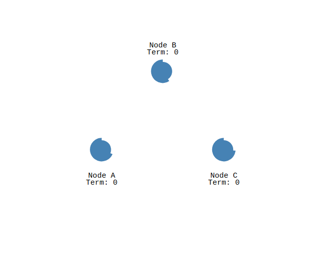
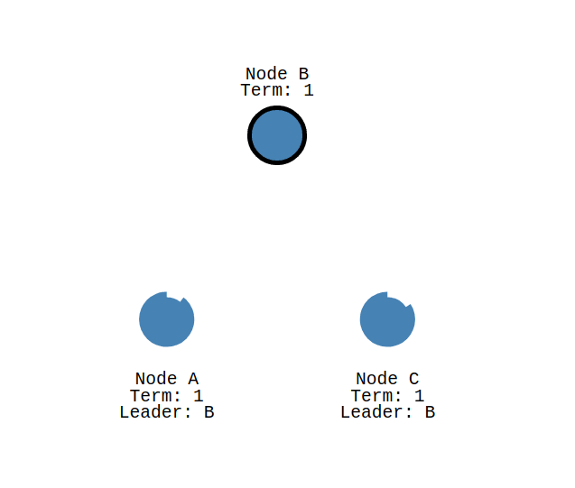
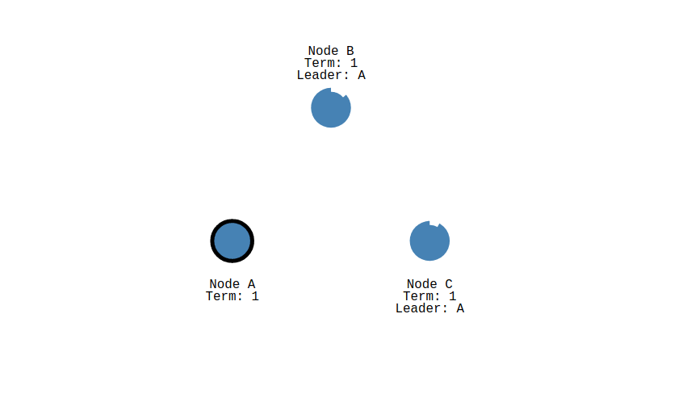
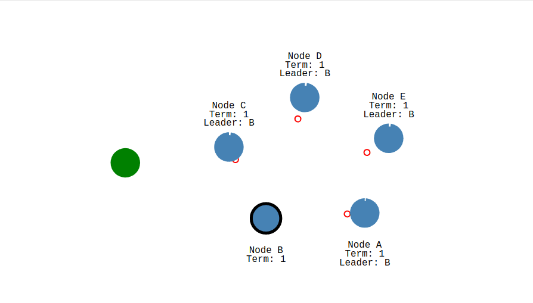

# 分布式一致性算法——Raft算法

上个小节我们介绍了2PC算法，属于CA算法。本小节我们介绍一个属于CP的算法——raft。

一致性算法允许一组机器像一个整体一样工作，即使其中一些机器出现故障也能够继续工作下去，这个特性使得一致性算法一直是产业界研究的热门，在产业界机器故障是需要纳入架构设计中的。

在介绍raft之前需要引入两个概念 —— 状态机和状态机复制。对于我们程序员来说这两个概念在工作中其实非常常见，我们需要明白常见到东西经常会被抽象成模型，因为只有做了这个抽象化的模型后才更好的进行研究。

## 状态机（FSM）

状态机又称有限状态机（finite-state machine 简称FSM），是表示有限个状态以及在这些状态之间的转移和动作等行为的数学计算模型。

状态机被定义为下面这些值元组：
- 一组状态
- 一组输入
- 一组输出
- 一个转换函数（输入 x 状态 → 状态）
- 一个输出函数（输入 x 状态 → 输出）
- 被称为“初始”的一个独特状态

一个状态机从“初始”状态开始，每一个输入都被传入转换函数和输出函数，以生成一个新的状态和输出。在新的输入被接收到前，状态保持不变。

看到这个模型的定义内容我们很容易联想到数据库其实就是一个经典的状态机模型。刚创建的数据库就是一个初始状态，然后接收不同的输入（增，删，改）后根据本身状态计算出新的状态，查询可以理解成输出状态，查询的时候带的函数根据当前的状态计算出新的结果输出。

## 状态机复制

上边介绍了状态机，状态机必须具备确定性：多个相同状态机的拷贝，从同样的“初始”状态开始，经历了相同的输入序列后，会达到同样的状态，并且输出同样的结果，这个过程我们称为状态机复制。

上图中展示了通过日志方式实现的状态机的复制，client通过调用 `Consensus Module`（一致性模块），一致性模块产生相同的日志，然后发给多个状态机，这几个状态机接收相同的日志后，执行得到的状态是一样的。

这个模型我们也应该很快联想到数据库的主从复制，主数据库接收各种输入，然后把这种输入复制一份给从数据库，从数据库就能生成和主数据库一模一样的数据。
在计算机领域，状态机复制是实现容错服务的常见方式。但是在这边我们更关注这个 `Consensus Module`，这个一致性模块就是一致性算法的工作核心——保证复制日志相同。在一台服务器上，一致性模块接收客户端发送来的指令然后增加到自己的日志中。它和其他服务器上的一致性模块进行通信来保证每一个服务器上的日志最终都以相同的顺序包含相同的请求，尽管有些服务器会宕机。一旦指令被正确的复制，每一个服务器的状态机按照日志顺序处理他们，然后输出结果被返回给客户端。因此，服务器集群看起来形成一个高可靠的状态机。

实际系统中使用的一致性算法通常含有以下特性：

- 安全性保证（绝对不会返回一个错误的结果）：在非拜占庭错误情况下，包括网络延迟、分区、丢包、冗余和乱序等错误都可以保证正确。
- 可用性：集群中只要有大多数的机器可运行并且能够相互通信、和客户端通信，就可以保证可用。因此，一个典型的包含 5 个节点的集群可以容忍两个节点的失败。服务器被停止就认为是失败。他们当有稳定的存储的时候可以从状态中恢复回来并重新加入集群。
- 不依赖时序来保证一致性：物理时钟错误或者极端的消息延迟只有在最坏情况下才会导致可用性问题。
- 通常情况下，一条指令可以尽可能快的在集群中大多数节点响应一轮远程过程调用时完成。小部分比较慢的节点不会影响系统整体的性能。

## Raft算法

Raft是一种用来实现`Consensus Module`功能的一种算法。raft通过选举选出一个Leader，然后这个leader复制日志到其他服务器上，在保证安全的时候通知其他服务器将日志应用到状态机上。Leader自己可能宕机，Leader宕机后会新的一轮选举会产生新的Leader。

raft通过Leader的方式可以将一致性问题分解为如下三个问题：
- Leader选举：当现存的Leader宕机的时候,一个新的Leader很快被选举出来。
- 日志复制：Leader必须从客户端接收日志然后复制到集群中的其他节点，并且强制要求其他节点的日志保持和自己相同。
- 安全性：如果有任何的服务器节点已经应用了一个确定的日志条目到它的状态机中，那么其他服务器节点不能在同一个日志索引位置应用一个不同的指令。

## Leader选举

在接收Leader选举前需要看下，raft的节点状态迁移和任期。

###  节点状态
raft节点有三个状态：
- Leader（领导者）
- Follwer（跟随者）
- Candidate（候选人）

在任何时刻，每一个服务器节点都处于这三个状态之一：Leader、 Follwer或者Candidate

每个节点一开始都是Follwer，在一定时间内没有收到Leader发过来的心跳包后，会触发一个timeout，这个时候节点会让自己变成候选者，给集群里头的机器发信息，发起投票。

### 任期

raft把时间被划分成一个个的任期，每个任期开始都是一次选举。在选举成功后，Leader会管理整个集群直到任期结束。有时候选举会失败，那么这个任期就会没有Leader而结束。任期之间的切换可以在不同的时间不同的服务器上观察到。

### Leader选举过程

- 每个节点初始化的时候都是跟随者。
- 领导人维护地方是通过给所有的跟随者发心跳检查实现。
- 跟随者在一定时间内没有收到心跳检测会把自己变成候选者，要求集群里头的节点投票

如上图动画显示，在trem 0时集群没有Leader，在节点B在超时时间内没有接收到心跳包后会发动选举，它的角色由Follwer变成Candidate，这个时候进入trem1，它先给自己投了一票，然后让节点 A和节点 C投票，投票通过后节点 B作为Leader会一直和节点 A和节点 C 维持心跳。

接下来我们看下节点 B节点做为Leader后宕机的情况。

如上图动画显示，节点B宕机后，在一个心跳周期内没有收到心跳包，节点A变成Candidate，然后任期进入trem 2,节点A给自己投票，然后让节点C投票，A变成了Leader。

## 日志复制

当Leader被选举后会作为唯一和client交互的节点（raft的设计是为了保持数据一致性和高可用，性能不是最重要的点，但是在产业界性能会被考虑，很可能Flower也会做成一个和用户交互的节点，甚至提供数据读取功能，尽管这个数据可能和Leader的数据可能不一致）。客户端的每一个请求都包含一条被复制状态机执行的指令（一般在数据库场景时，查询不会改变状态，所以不复制日志）。Leader将日志通过rpc发送给Follwer，然后收集集群一半以上（包括他自己）收到日志的反馈后，执行日志中的的指令。
领导执行指令成功后,通过rpc通知集群跟随者执行日志指令。
如果跟随者崩溃或者运行缓慢，再或者网络丢包，领导人会不断的重复尝试附加日志条目RPC直到所有的跟随者都最终存储了所有的日志条目。

如上图动画所示 Leader节点A收到客户端SET 5的请求，然后经日志复制给节点B和C，主要这个时候日志的状态为uncommit，等收到B和C的反馈后，节点A将日志commit，这个时候节点A的状态机的值变成5，然后再通知节点B和C将日志commit。上图演示的是理想情况下，网络不出现分区的情况。

网络分区将原先的 Leader节点和 Follower节点分隔开，Follower收不到Leader的心跳将发起选举产生新的 Leader，这时就产生了双 Leader我们称之为“脑裂”。原先的 Leader 独自在一个区，向它提交数据不可能复制到多数节点所以永远提交不成功。向新的 Leader 提交数据可以提交成功，网络恢复后旧的 Leader 发现集群中有更新任期（Term）的新 Leader 则自动降级为 Follower 并从新 Leader 处同步数据达成集群数据一致。

## 安全性

我上面讨论的raft中Leader的选举和日志的复制，但是并没有讨论到如何保证所有状态机是按相同的顺序正确执行日志的。接下来介绍raft如何做到这一点的。

raft做了选举限制，Leader需要有全部的日志，在投票的时候没有包含全部日志的节点不会被选举。Raft通过比较两份日志中最后一条日志条目的索引值和任期号定义谁的日志比较新。如果两份日志最后的条目的任期号不同，那么任期号大的日志更加新。如果两份日志最后的条目任期号相同，那么日志比较长的那个就更加新。这一限制保证了任何的领导人对于给定的任期号，都拥有了之前任期的所有被提交的日志条目。

## 总结

本小节讨论了raft算法的一些主要原理，raft原始论文中还有本文没有提及的一些内容，比如集群成员变化和日志压缩的讨论，感兴趣的可以参照参考文档中原始论文了解下。

在go语言生态里，raft算法已经有很好的实现比如[etcd的raft](https://github.com/etcd-io/etcd/tree/master/raft)，还有[consul的raft实现](https://github.com/hashicorp/raft)。

还有一点需要说明下，raft中所有的节点数据应该是一模一样的，但是对外服务的应该是只有Leader节点。很多初学者不理解，为什么增加了那么多的机器只是做了隐形备份机？严格意义上说raft算法会让整个集群的性能甚至比不上一个Leader单机的性能（因为没有日志复制和状态收集）。备份的机器是为了在Leader宕机后有后续的Leader能产生，不是为了提高数据吞吐能力。当然在产业界raft的这种机器冗余基本上比较难接受，很多运用都对Follower功能做了一定改造，有兴趣的可以去了解写Tidb多raft的一些改造。

## 参考文档

- [raft](https://ramcloud.atlassian.net/wiki/download/attachments/6586375/raft.pdf)
- [raft动画演示](http://thesecretlivesofdata.com/raft/)
- [raft中文翻译](https://github.com/maemual/raft-zh_cn/blob/master/raft-zh_cn.md)