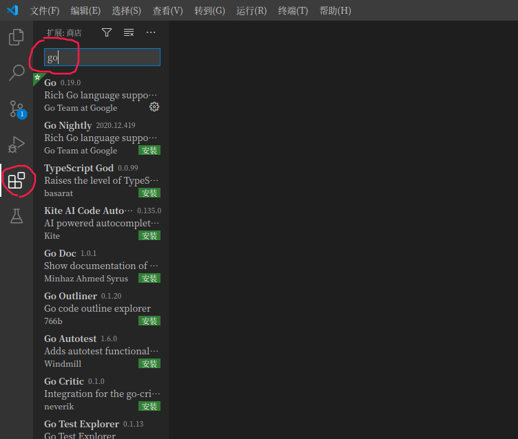
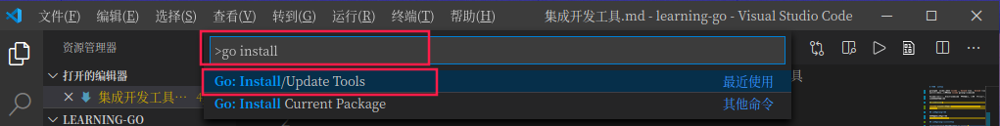
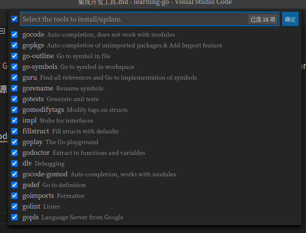
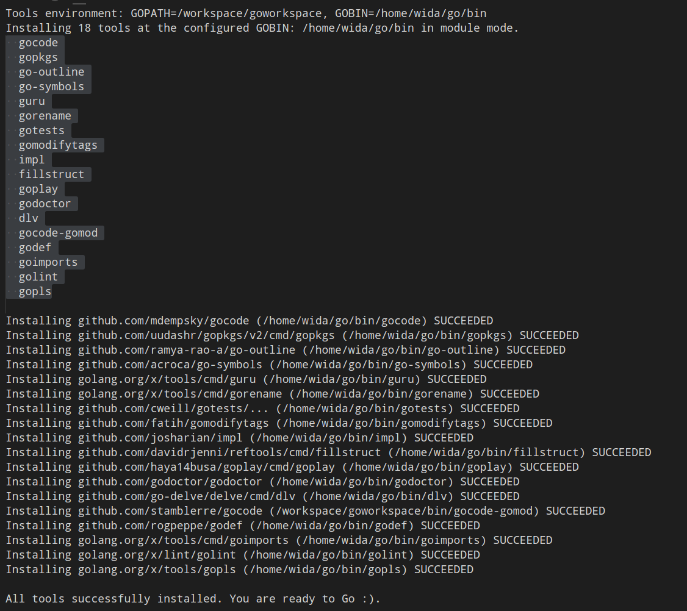

# 集成开发工具

golang的开发ide主要有`vscode`和`Goland`，由于`Goland`是付费产品，本小节我们注重介绍`vscode`golang环境搭建。

Vscode是微软基于Electron构建的开源编辑器, 是这几年非常流行而且异常强大的编辑器。

## 安装vscode 

`vscode`官方下载地址：https://code.visualstudio.com/Download

## 安装golang插件

首先需要安装go插件

## 安装golang环境其他工具

按`Ctrl+Shift+P`快捷键，输入`go install`

然后选择`Go:Install/Update Tools`会出来如下弹窗：

全选安装工具。

安装完成后

到此golang开发环境搭建算是完成了。初学者可以安装vscode插件`Code Runer`方便调试运行。
