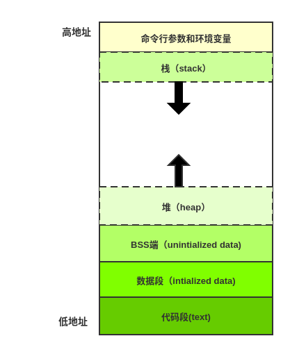

# go汇编简介

## 为什么要学习go汇编

go 虽然刚过了10周年的生日，但是go的编译器编译的汇编指令优化程度不是很高，无法和c/c++生态相比。在一些高频使用的算法和函数，go原生有时候显得比较无力。go标准库里头特别是算法库和runtime都大量使用go汇编。
我们在写向量计算的相关代码时，如果利用cpu的sse和avx的指令集会带来可观的性能提升。
我们在排查问题或者了解go底层代码是如何运行的，那么go汇编回事一个利器。汇编代码面前一切了无秘密。

## go汇编

go汇编和不同于inter汇编和AT&T汇编，go汇编源于plan9汇编，plan9汇编的相关知识感兴趣的可以去了解下，这里不多做介绍。go汇编是go语言的一部分，只能和go语言源码文件一起编译使用，不像inter汇编和AT&T汇编可以单独编译运行。

## CPU 通用寄存器

通用寄存器的名字在 X64 和 plan9 中的对应关系:

| X64 | rax | rbx| rcx | rdx | rdi | rsi | rbp | rsp | r8 | r9 | r10 | r11 | r12 | r13 | r14 | rip|
|--|--|--|--| --| --|--| --|--|--|--|--|--|--|--|--|--|
| Plan9 | AX | BX | CX | DX | DI | SI | BP | SP | R8 | R9 | R10 | R11 | R12 | R13 | R14 | PC |

## 一个程序的内存布局

- 代码段:存储程序指令，位于内存最低端
- 数据段（初始化数据段）：全局变量或者静态变量，数据段分只读区和读写区。
- BSS段（未初始化数据段）：未初始化全局变量
- 栈：一种LIFO结构，从高地址向低地址增长。
- 堆：动态分布内存区，从低向高增长。

# 参考资料

- [golang-asm](https://lrita.github.io/2017/12/12/golang-asm)
- [A Manual for the Plan 9 assembler](https://9p.io/sys/doc/asm.html)