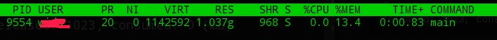
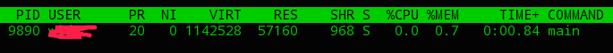

# GODEBUG追踪GC

上一小节我们介绍了通过设置环境变量`GODEBUG`追踪go调度器的信息的方法。其实`GODEBUG`还可以追踪go`GC`，本小节将介绍如何用`GODEBUG`追踪go的`GC`。

我们先写一个demo程序

```go
package  main
import (
	"runtime/debug"
	"time"
)
func main()  {
	num := 500000
	var bigmap = make(map[int]*[512]float32)
	for i := 0;i < num;i++ {
		bigmap[i] = &[512]float32{float32(i)}
	}

	println(len(bigmap))
	time.Sleep(15e9)
	for i := 0;i < num;i++ {
		delete(bigmap,i)
	}

	debug.FreeOSMemory()
	time.Sleep(1000e9)
}
```
我先编译下
```bash
$ go build -o test
```

## 追踪go GC

运行`GODEBUG=gctrace=1`

```bash
$ GODEBUG=gctrace=1 ./test
```

会显示如下信息
```
...
500000
gc 10 @16.335s 0%: 0.004+1.0+0.004 ms clock, 0.016+0/1.0/2.9+0.016 ms cpu, 1006->1006->0 MB, 1784 MB goal, 4 P (forced)
scvg: 1 MB released
scvg: inuse: 835, idle: 188, sys: 1023, released: 17, consumed: 1005 (MB)
forced scvg: 1005 MB released
forced scvg: inuse: 0, idle: 1023, sys: 1023, released: 1023, consumed: 0 (MB)
```

我们可以在[go runtime](https://golang.org/pkg/runtime/) 看到gc日志的格式的相关信息

### gc日志

格式如下：
` gc # @#s #%: #+#+# ms clock, #+#/#/#+# ms cpu, #->#-># MB, # MB goal, # P`

```
gc 10 @16.335s 0%: 0.004+1.0+0.004 ms clock, 0.016+0/1.0/2.9+0.016 ms cpu, 1006->1006->0 MB, 1784 MB goal, 4 P (forced)
```
- gc 10: gc的流水号，从1开始自增
- @16.335s: 从程序开始到当前打印是的耗时
- 0%: 程序开始到当前CPU时间百分比
- 0.004+1.0+0.004 ms clock: 0.004表示STW时间；1.0表示并发标记用的时间；0.004表示markTermination阶段的STW时间
- 0.016+0/1.0/2.9+0.016 ms cpu: 0.016表示整个进程在mark阶段STW停顿时间;0/1.0/2.9有三块信息，0是mutator assists占用的时间，2.9是dedicated mark workers+fractional mark worker占用的时间，2.9+是idle mark workers占用的时间。0.016 ms表示整个进程在markTermination阶段STW停顿时间(0.050 * 8)。
- 1006->1006->0 MB: GC开始、GC结束、存活的heap大小
- 1784 MB goal:下一次触发GC的内存占用阈值
- 4 P: 处理器数量
- (forced): 可能没有，代表程序中runtime.GC() 被调用

### scvg日志: 

go语言把内存归还给操作系统的过程叫scavenging，scvg日志记录的就是这个过程的日志信息。
scvg 每次会打印两条日志
格式：
```
scvg#: # MB released  printed only if non-zero
scvg#: inuse: # idle: # sys: # released: # consumed: # (MB)
```
```
scvg: 1 MB released
scvg: inuse: 835, idle: 188, sys: 1023, released: 17, consumed: 1005 (MB)
```
- 1 MB released: 返回给系统1m 内存
- inuse: 正在使用的
- idle ：空闲的
- sys ： 系统映射内存
- released:已经归还给系统的内存
- consumed：已经向操作系统申请的内存


我们看到`debug.FreeOSMemory()`运行后
```
forced scvg: 1005 MB released
forced scvg: inuse: 0, idle: 1023, sys: 1023, released: 1023, consumed: 0 (MB)
```
这个时候`released`内存是1023m，说明go语言已经正常把内存交给操作系统了了。可是RSS信息显示go仍然占用这这个内存。



这又是为什么？golang在把内存规划给类linux系统（linux-like）时发送的指令是`建议回收`指令，那么系统可以根据自己负载情况决定是否真的回收。

在[go runtime](https://golang.org/pkg/runtime/)中我们找到一段如下的文字。
```
madvdontneed: setting madvdontneed=1 will use MADV_DONTNEED
instead of MADV_FREE on Linux when returning memory to the
kernel. This is less efficient, but causes RSS numbers to drop
more quickly.
```
翻译一下：

```
madvdontneed：如果设置GODEBUG=madvdontneed=1，golang归还内存给操作系统的方式将使用MADV_DONTNEED，而不是Linux上的MADV_FREE的方式。虽然MADV_DONTNEED效率较低，但会程序RSS下降得更快速。
```

动手试一试
```bash
$ GODEBUG=madvdontneed=1 go run main.go
```

这下RSS正常了。


### MADV_FREE和MADV_DONTNEED

MADV 是linux kernel的内存回收的方式，有两种变体（MADV_FREE和MADV_DONTNEED，可以参考
[MADV_FREE functionality](http://lkml.iu.edu/hypermail/linux/kernel/0704.3/3962.html)文档。


## 总结

本小节介绍了用`GODEBUG`追踪go GC的方法，介绍了tracing日志的格式。GC的追踪在排查程序内存占用问题特别有用。